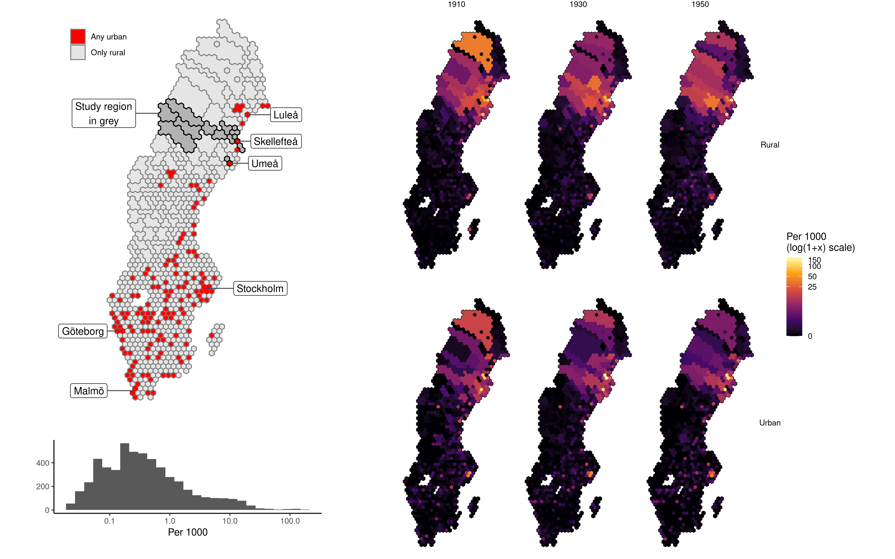

# hexgridmap

## Overview

`hexgrid` transforms irregular spatial polygons into a hexagonal grid
representation, making it easier to visualize geographical patterns when
dealing with polygons of vastly different sizes. This is particularly
useful when working with administrative boundaries like parishes,
municipalities, or census tracts that vary dramatically in size.

For example, when visualizing Swedish parishes, the tiny Stockholm
domkyrka and vast Jukkasjärvi parish can be represented more effectively
using standardized hexagonal units while maintaining their spatial
relationships.



## Features

-   Converts irregular polygons to a standardized hexagonal grid
-   Combines small polygons into single hexagons
-   Allows large polygons to span multiple hexagons
-   Preserves spatial relationships
-   Handles edge cases and partial coverage
-   Maintains linkage between original polygons and hex units

## Installation

You can install the development version from GitHub with:

``` r
# install.packages("devtools")
devtools::install_github("junkka/hexgridmap")
```

## Usage

Here's a basic example:

``` r
library(hexgridmap)
library(sf)
library(ggplot2)

# Read your spatial data
parishes <- read_sf("path/to/parishes.shp")

# Create hexagonal representation
result <- create_hex_map(
  sf_object = parishes,
  hex_size = 25000,  # 25km in projection units
  min_coverage = 0.2,
  id_col = "parish_id",
  name_col = "name"
)

# Plot the result
ggplot(result$hex_sp) +
  geom_sf(aes(fill = geom_ids)) +
  theme_minimal() +
  ggtitle("Parish Hexagonal Representation")

# Check assignments
head(result$hex_links)
```

## Use Cases

The package is particularly useful for: - Visualizing administrative
boundaries of varying sizes - Creating standardized choropleth maps -
Comparing spatial patterns across regions with different polygon sizes -
Generating tile-based representations of irregular spatial data

## Function Documentation

### create_hex_map()

Main function for creating hexagonal grid representations.

**Arguments:** - `sf_object`: An sf object containing the polygons to be
transformed - `hex_size`: Size of hexagonal cells in the same units as
sf_object - `min_coverage`: Minimum proportion (0-1) of hex that must be
covered - `id_col`: Name of column containing unique identifiers -
`name_col`: Optional column name containing polygon names

**Returns:** A list with two elements: - `hex_sp`: An sf object
containing the hexagonal grid - `hex_links`: A data frame linking
original polygon IDs to hex assignments

## Citation

If you use this package in your research, please cite it as:

```         
@misc{hexgridmap2024,
  author = {Johan Junkka},
  title = {hexgridmap: Transform Irregular Spatial Polygons into Hexagonal Grid Representation},
  year = {2024},
  publisher = {GitHub},
  url = {https://github.com/junkka/hexgridmap}
}
```

## Related Work

-   [sf](https://r-spatial.github.io/sf/): Simple Features for R
-   [histmaps](https://github.com/junkka/histmaps): Historical Maps of
    Sweden
